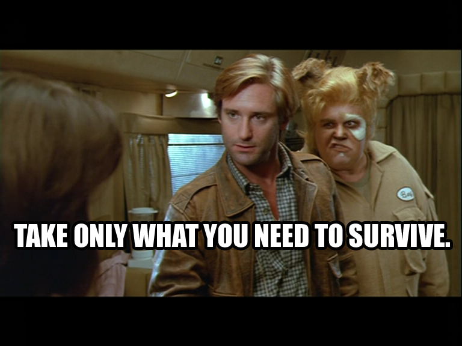

# Go Makes Things Simple

If you have built a web application before, you surely know that there are
quite a lot of concepts to keep in your head. HTTP, HTML, CSS, JSON, databases,
sessions, cookies, forms, middleware, routing and controllers are just a few
among the many things your web app *may* need to interact with.

While each one of these things *can be important* in the building of your web
applications, not every one of them *is important* for any given app. For
instance, a web API may just use JSON as its serialization format, thus making
concepts like HTML not relevant for that particular web app.

## The Go Way

The Go community understands this dilemma. Rather than rely on large,
heavyweight frameworks that try to cover all the bases, Go programmers pull in
the bare necessities to get the job done. This minimalist approach to web
programming may be off-putting at first, but the result of this effort is a much
simpler program in the end.

**Go makes things simple,** it's as easy as that. If we train ourselves to
align with the *"Go way"* of programming for the web, we will end up with more
**simple**, **flexible**, and **maintainable** web applications.

## Power in Simplicity

As we go through the exercises in this book, I think you will be surprised by
how simple some of these programs can be whilst still affording a bunch of
functionality.

When sitting down to craft your own web applications in Go, think hard about
the components and concepts that your app will be focused on, and use just
those pieces. This book will be covering a wide array of web topics, but do not
feel obligated to use them all. In the words of our friend Lonestar, *"Take
only what you need to survive"*.

